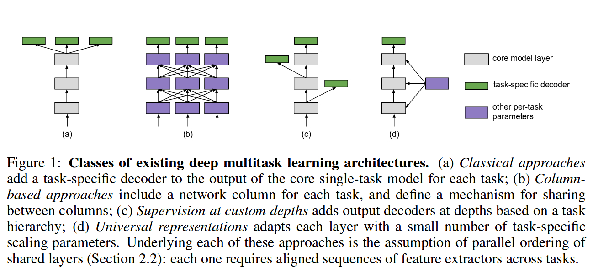
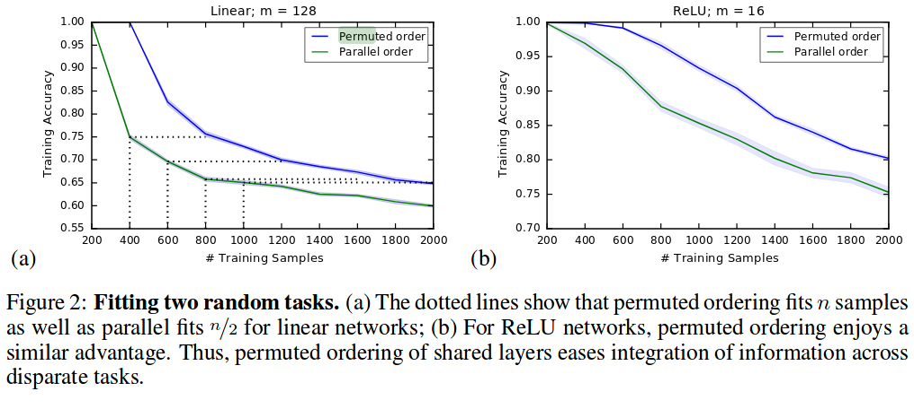

# Beyond Shared Hierarchies: Deep Multitask Learning through Soft Layer Ordering

## 0. abstract
* parallel ordering 相比 permuted ordering， 在MTL中的好处。
* flexible ordering 可以让feature在shared layers里有more effective sharing。
* 接着作者提出了 soft ordering，可以学习到shared layers对于不同的任务是如何工作的。
* 在一系列domain中，soft ordering的表现是优于parallel ordering的。
* 结论：deep MTL的强大功能来自于学习到了高度通用的building blocks，这些blocks可以assembled以满足每项任务的需求。

## 1. Introduction
### 1.1
* 传统方法通过利用任务中存在的规律性，利用辅助数据集来提高整体性能。
* 最近的一些方法在single-task上表现良好，但在joint training或closely-related tasks上却表现一般。
* 即使是跨领域，例如CV和NLP，仍然可以从sharing中获益。
* 换句话说，对于一个可以充分表达类别的模型（？sufficiently expressive class of models），要求模型同时适应多个任务，同时（各类别的）归纳偏差应该鼓励学习收敛到更realistic的表示。
* 为什么MTL仍有局限性？
### 1.2
* MTL基于以下假设：模型学习到的transformations可以在各个任务之间共享。 
* 本文确定了深度MTL现有方法的另一个隐含假设：这种共享通过层的parallel ordering来实现。也就是说，任务之间的共享仅发生在模型体系结构所隐含的特征层次结构中的对齐层上。 此约束限制了任务之间可能发生的共享类型。因为任务是多样复杂的。
* **Permuted Ordering的概念：in which shared layers are applied in different orders for differ-
ent tasks** 个人理解：对于不同的任务，权重分享层会以不同的顺序去分配权重（应该不是人为调控的，是可以学习到的）
* **本文主要研究DMTL是否需要parallel ordering，通过Section.3的实验（引入了Permuted Ordering）得出结论：使用PO可以使integration of information across tasks表现更好，然后作者构建了一种名叫soft ordering的方法应用在DMTL上（下文还会提到）。**

### 1.3
* 什么是soft ordering？个人理解SO没有固定的方式，它指的是：联合模型学习如何在不同深度以不同方式为不同任务应用共享层，同时学习这些层本身的参数。
* 作者先研究了对于MTL来说，parallel ordering是否是必要的，最后得出soft ordering能明显提升single-task的表现，并且对fixed order deep MTL也有效。
* soft ordering未来还有许多潜在的作用，特别是对于MTL中complex tasks。

## 2. Parallel Ordering of Layers in Deep MTL
* 这部分介绍了现有MTL方法对parallel ordering的依赖性
### 2.1
* 所有DMTL都面临着同一个问题：如何把学习到的参数在不同层之间共享？
    *  
    * 传统方法：添加输出神经元来预测相关任务的辅助标签，这些标签将充当隐藏表示的正则项。深度学习中很多方法都是这种思路：在高层学习特征表示，然后最后添加decoders为不同的任务提取特征。这种做法可以用于task-specific input，等于转化为single-task去处理，但核心网络仍是全共享的。
    * Column-based approaches：每层之间都可以共享features，但很多任务对feature的要求是不一样的，因此这种做法并不可靠。
    * Supervision at custom depths：只有在matching depths才共享，并在不同的depth进行预测，这种做法证明了学习transformations对MTL是很有效的，尤其是对不同深度的不同任务。
    * Universal representations：根据不同的自适应地提供一些task-specific task的参数。当任务中的类数（number of classes across tasks）相等时，甚至可以共享输出层，而少量参数可以保持强大的性能。 该方法适用于各种各样的视觉任务，展示了少量参数scaling parameters在调整不同任务的层功能方面的能力。 为第三部分的实验设计提供了思路。

### 2.2
* 一个假设：学习到的不同特征和网络深度是有关的
* **特征层次结构的子序列在任务中对齐，并且任务之间的共享仅在对齐的深度处发生（图1）我们称之为parallel ordering假设**。(重点）
* 这种结构的缺陷，对于太多的相近任务，将变得难以区分（由于提供了很相似的权重值），对于不太相似的，task feature hierarchies又变得难以match up。
* **本文探讨的猜想是，parallel ordering通过强制约束每个层的使用，是否在一定程度上限制了DMTL的潜力？（又一次提到）**

## 3. Deep Parallel Ordering Assumption
### 3.1 A FOIL FOR THE PARALLEL ORDERING ASSUMPTION : PERMUTING SHARED LAYERS
* 作者抽象出了Permuted Ordering的函数
* 概念：hard-sharing of layers：指的是在多个任务中完全共享权值W的层

### 3.2 The Increased Expressivity of Permuted Ordering
* 
* 在实验演示的ReLU中，Parallel Order是不必要的。结论：共享层的permuted ordering简化了跨任务的信息集成。
* 思考：为什么在Linear networks中，两者的表现不一样呢？
