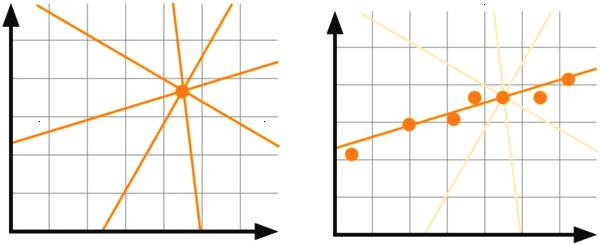
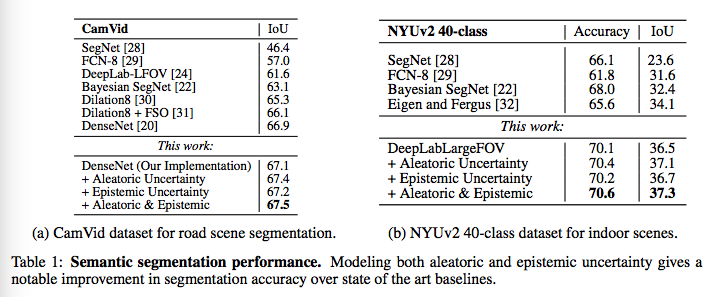
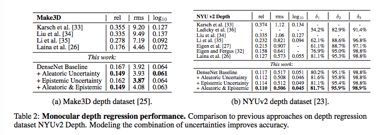
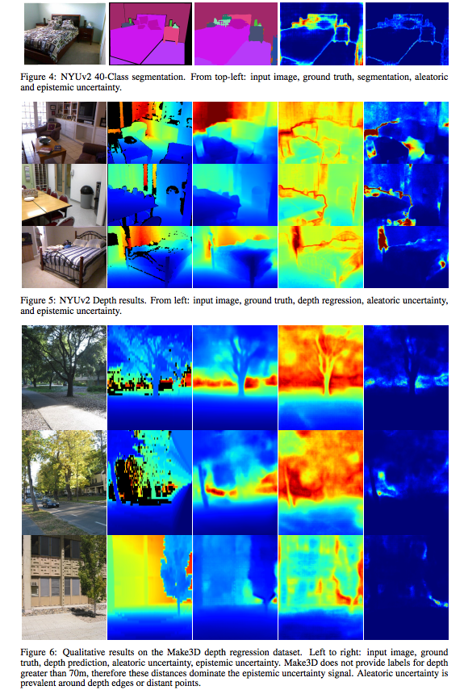
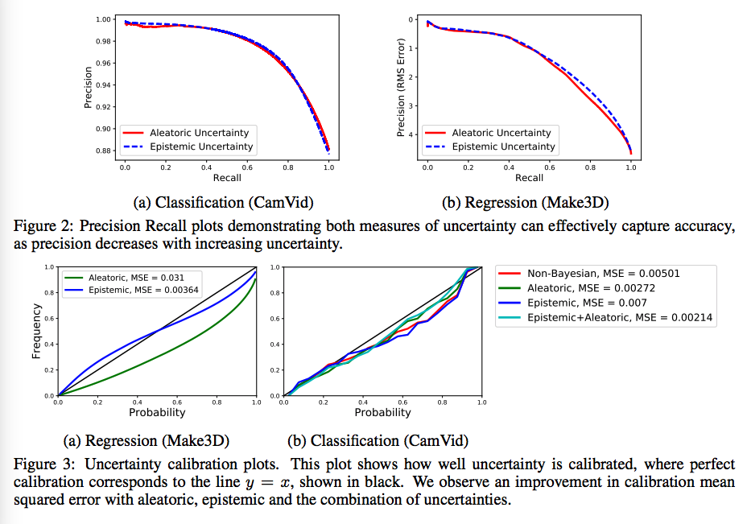
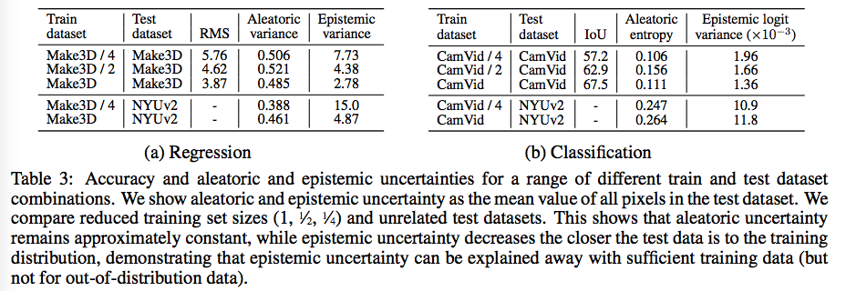

## 笔记作者的话
理解本篇文章，首先要对两种不确定性有深刻的理解
### 随机不确定性 
* [原文链接](https://blog.csdn.net/chichuhe/article/details/83047507)
* 随机不确定性：此种不确定性主要由自然变异和随机性引起。随机不确定性的例子包括风速、风向、降雨量、产品质量的变化、污染物在食品中的浓度等。
* 例子１：考虑一个化工厂毒气泄露的事故场景，有毒气体泄露后形成毒气云其最终影响取决于实时的风向。通过对相关地点风向的长期观察，我们可以拟合出不同方向d的概率分布。在事故场景发生的时候，我们无法确定毒气云一定会吹向居民区，但是我们可以使用分布F（d）寻找事件的概率。
* 认知不确定性
* 此种不确定性主要是由于缺乏知识引起。常见的例子包括转基因食品的健康风险以及二氧化碳排放导致全球变暖的担忧。从原理上讲，如果我们获得了有关研究对象足够的知识，就可以消除这种不确定性。鉴于随着知识增加，认知不确定性可以因此降低，所以它也可以被称为可降低的不确定性。与随机不确定性相反，认知不确定性依赖于评估者的知识水平，因此它还被称为主观不确定性。
* 认知不确定性也被称为无知（ignorance）（Salvatore Modica,1997）和表象不确定性。
* 无知可以分为两种：认识到的无知和没有认识到的无知。认识到的无知是指，我们知道自己不知道，并希望在进行风险分析的时候采取相应措施。而没有认识到的无知则更加危险，因为我们根本不知道自己不知道，说的更严重点，就是我们对于风险评估结果的信心可能就是一种错觉。
* 例子２：现在，有很多基于纳米技术的新产品不断问世。然而许多人都在担心纳米颗粒会对他们的健康以及地球环境造成伤害。但是至少到现在（2014年），纳米技术的影响还无从所知，因此与使用这项技术相关的认知不确定性还非常高。随着人们关于纳米技术的经验越来越多，认知不确定性也就会随之降低。

### 为什么要关心不确定性？
* [原文链接](http://wemedia.ifeng.com/72003766/wemedia.shtml)
* 比较典型的例子是高风险应用。假设你正在建立一个模型，帮助医生决定患者的首选治疗方案。在这种情况下，我们不仅要关心模型的准确性，还要关注模型对预测的确定程度。如果不确定性太高，医生应该将此考虑在内。
* 自驾车也是一个例子。当模型不确定道路上是否有行人时，我们可以使用此信息来减慢车速或触发警报，以使驾驶员接手。
* 不确定性也可以帮助我们摆脱数据实例。如果模型没有使用类似于手边样本的实例进行训练，那么如果它能够说“抱歉，我不知道”可能会更好。这可以避免谷歌在将非洲裔美国人误认为大猩猩时这样的尴尬错误。这种错误有时是由于训练集不够多样化产生的。
* 最后一次使用不确定性（也是本文的目标），是从业者调试模型的工具。我们稍后会深入研究这个问题，但首先，让我们谈谈不同类型的不确定性。
* 
* 左侧：没有足够的数据导致高度不确定性。右边：给定更多数据不确定性降低
* 
* 举个例子，假设你想要建立一个能够获得动物图片的模型，并预测该动物是否会尝试吃掉你。假设你用狮子和长颈鹿的图片训练模型，现在它看到了一个僵尸。由于该模型没有在僵尸图片上进行过训练，因此不确定性很高。这种不确定性就是模型的结果，如果给出僵尸图片够多，不确定性就会减少。

## 摘要
* 主要有两种不确定性，偶然不确定性（aleatoric uncertainty）捕获观测中固有的噪声，认知不确定性（epistemic uncertainty）用来描述模型中的不确定性，这种不确定性可以在有充足的数据量的情况下得到合理解释。
* 使用贝叶斯深度学习工具可以帮助理解计算机视觉中的不确定性。
* 提出了一个贝叶斯深度学习框架，研究了像素级的语义分割和深度回归任务。
* 同时，基于所提出的不确定性公式，本文针对以上问题设计了新的损失函数，这使得衰减项对噪声具有更高的鲁棒性，同时得到目前性能最好的语义分割和深度回归结果。

## 介绍
* 很多机器学习算法可以很好地将高维空间的数据映射成低维数组，但很少考虑这些映射的准确率，从而导致很多灾难性的后果。
量化不确定性在计算机视觉领域可以被分为回归和分类两大类。现存的描述不确定性的方法有粒子滤波法，条件随机场法。深度学习方法往往很难描述不确定性。例如在分类问题中，深度学习算法常常更够给出归一化的得分向量，但是不需要计算模型的不确定性。基于贝叶斯的深度学习算法则可以在拥有深度学习高性能的同时计算出模型的不确定性。
* 同方差不确定性（homoscedastic）和异方差不确定性（heteroscedastic）。偶然不确定性是同方差不确定性，是模型固有不确定性；认知不确定性是异方差不确定性，是由于每个输入的噪声不同造成的。
* 在大数据背景下对偶然不确定性进行建模是十分重要的，偶然不确定性往往是不能通过大量数据进行解释的，因此本文提出一种统一的贝叶斯深度学习框架对偶然不确定性进行映射并将其与认知不确定性相结合，本文所提出的框架可同时在分类和回归问题中进行使用。
### 创新点：
* 我们掌握了对偶然和认知不确定性的精确的描述方法，特别的，我们提出了一种新的基于不确定性的 分类方法。
* 通过明确表示出偶然不确定性而获得的隐含衰减（the implied attenuation）减少了噪声的影响，基于此，我们提出的模型可以提高非贝叶斯模型性能的1-3%。
* 本文通过表征两种不确定性的特性以及比较两种模型的性能和计算时间来研究如何对两者进行权衡。

## 实验结果
* 本文在像素级的深度回归和语义分割问题上对所提出的模型进行了测试。
* 为了展示本文所提出的可以学习的损失衰减的鲁棒性（对不确定性建模的好处之一），我们在CamVid, Make3D和NYUv2 Depth数据集上进行了测试，并取得了目前最好的性能。
* 在实验中，我们利用了DenseNet的框架（用于深度回归问题），并对其稍微进行了改进（在CamVid上进行测试比改进前的性能提高了0.2%）。
* 在所有的实验中，我们将训练图像裁剪成224x224，batch的大小为4，然后利用全尺寸图进行精调，batch大小为1，采用RMS-Prop优化方法，学习率为0.001，权值衰减率为10^-4。
* 我们利用蒙特卡洛dropout来对认知不确定性进行建模，DenseNet框架中采用的dropout概率为p=0.2，在每一个卷积层后使用，本文中我们使用50个蒙特卡洛dropout采样。我们利用上文提到的损失函数进行MAP推理从而对偶然不确定性进行建模。
* 在实际实验过程中，我们采用的是拉普拉斯先验而不是高斯先验，因为其采用的L1距离描述残差比高斯采用的L2距离更适合视觉回归问题。
### 语义分割
* 在此实验中，我们采用了CamVid和NYUv2数据集，其中CamVid是道路场景数据集包含367张训练图片以及233张测试图片，11个类别,实验结果如表一a所示，可以看出偶然不确定性对性能影响更大，结合两种不确定时系统性能最佳。
* NYUv2数据集是一个具有挑战的室内分类数据集，包含40中语义类别，实验结果如表一b所示。 
* 
### 像素级深度回归
* 在此实验中，我们采用了Make3D和NYUv2 Depth数据集，实验结果如表二所示，结果表明偶然不确定在此类问题中发挥了很大作用，如图五、图六所示，在图像深度较深，反射表面以及遮挡边界处的偶然不确定性值很大，这些地方往往是单目深度算法容易失败的地方。反观由于数据量太少，认知不确定很难发挥大作用。总的来说，我们通过直接学习系统噪声和复杂概念的衰减从而提高了非贝叶斯网络的性能，例如我们观察到遥远物体和物体和遮挡边界的偶然不确定性是比较高的。
* 
* 

## 分析：偶然不确定性和认知不确定性描述的本质是什么？
### 不确定性度量的质量
* 
* 在图二中我们给出了回归问题和分类问题的PR曲线，PR曲线说明了我们的模型性能可以通过消除不确定性大于某一阈值的像素来提高。这表示了不确定性的两种行为，一是不确定性测量与精度是相关的，因为所有曲线都是严格递减函数；二是两种不确定性的曲线是相似的，即使当只有一个不确定性能被建模时，它会在一定程度上弥补另一不确定性。 
* 在图三中我们用我们模型在测试集上的校准图分析不确定性度量。对于分类问题而言，我们通过将我们模型预测的概率离散化成一些数，然后画出正确预测的标注的频率对应的数，不确定性质量越高的预测应该与$y=x$更加接近。对于回归问题而言，我们可以通过比较预测分布的变化阈值内的残差频率来形成校准图 
### 与训练样本距离的不确定性
两个结论： 
* 1. 偶然不确定性无法通过更多数据解释。 
* 2. 偶然不确定性也不会因为与训练集不同的样本而增加，而认知不确定性会。 
* * 
* 在表三中我们给出了在子集不断增加的数据上训练模型的精度与不确定性，结果表明认知不确定性将随训练集增大而减小，结果同时表明偶然不确定性保持相对稳定，不能被更多数据解释。利用不同的数据集进行测试时认知不确定性会稍微增加。 
### 实时应用
* 在NVIDIA Titan X上一张640x480的照片的处理时间为150ms。偶然不确定性增加的时间可以忽略不计，认知不确定性蒙特卡洛采样是比较耗时的

## 结论
* 本文提出了一种新的贝叶斯深度学习框架可以从输入中学习偶然不确定性并与认知不确定性进行结合提高系统性能。

* 对以下情形计算偶然不确定性是比较重要的： 
* 1. 具有大量数据的情况，这种情况下认知不确定性是可以被解释的。 
* 2. 实时系统，偶然不确定性不会影响实时性。

* 对以下请性计算认知不确定性是比较重要的： 
* 1. 对安全性要求较高的应用，因为认知性能可以识别出当前场景与训练集是否一致。 
* 2. 小数据集情况。
* 两种不确定性并不相互排斥，将两者结合可以得到更好的性能。找到一个实时计算认知不确定性的系统是深度学习未来研究的重要方向。

