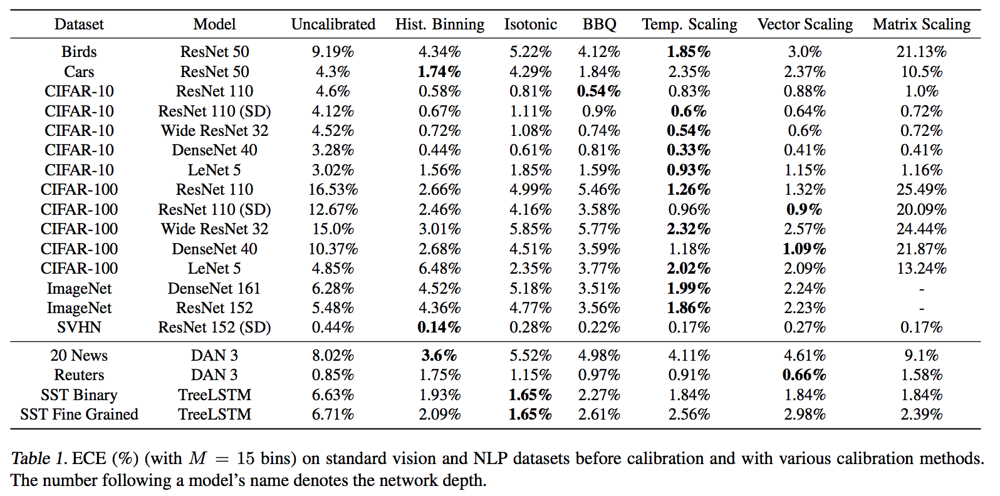

## 摘要
* 置信度校准 - 预测代表真实正确性的概率值估计问题，作者提出了temperature scaling，一种plat scaling的single parameter方法，可以有效地作用于calibrating predictions

## 介绍
* 分类网络不仅必须准确，而且还需要指出何时不准确。 
* 在汽车驾驶中，如果检测网络无法自信地预测障碍物，应该交由其他传感器的输出来判断。
* 在医疗中，如果机器没有信息去判断是否患病，则应该交由人类医生来决断。
* 另外就是可解释性很重要，良好的置信度估计可以提供额外的信息，也可以应用于其他的概率模型中。
* 一个例子
* 
* 上图中是两个不同网络的输出。
* X轴表示置信度（Confidence）区间, Y轴表示在某个预测置信度区间的数量占总测试集的百分比。
* 这篇论文的idea是对于一定数量的测试集，模型越可靠，平均置信度（Average Confidence）越接近准确率（Accuracy）。
* 从上图中可以发现，虽然Lenet 准确率比Resent低，但Lenet 模型输出置信度更能够代表真实的概率估计。

## 定义
* acc(Bm) = 1/|Bm| * ∑ 1(yi' = yi)
* conf(Bm) = 1/|Bm| * ∑ pi'
* 完美模型就是 acc = conf
* 
* 
* 完美模型，ECE和MCE都为0
* Negative log likehood是一个衡量模型质量的标准，和深度学习中的交叉熵loss很相似。
* L = -∑log(π'(yi|xi))，当π'和真实值一样时，其达到最小值。

## 观察miscalibration
### Model capacity
* 
* 从模型大小来看，对模型进行改动会对ECE产生如图所示的变化
* 增加置信度可以最小化NLL，增加模型的深度和宽度总体而言会降低NLL，模型也会更加自信。
### Batch Normalization
* 谈到了Batch Normalization的影响
* 虽然无法精确指出具体如何影响预测准确率，但作者实验观察到加入了BN反而会使模型miscalibrated
* 如图2所示，而且结果好坏与超参数无关，例如学习率大小
### Weight decay
* 出现了over-regularization和under-regularization，但不会因为WD的升高而出现负面影响。
* 实现最佳精度以后，可以添加更多的regularization，模型将继续改进。
* 最后轻微的升高可能是一些人为因素阻碍了优化。
### NLL
* 
* NLL是一种间接衡量模型calibration的方法。
* 作者发现，over-fitting NLL有助于提高分类准确性，测试中，error从29%降到了27%，但NLL此时处于over-fitting
* 网络会以well-modeled probabilities为代价，去学习更高的分类准确率。

## 校准方法
* 验证集固定且和训练集来自同一分布
### 二分类模型
* histogram binning
* isotonic regression
* bayesian binning into quantiles
* platt scaling
### 多分类模型
* extension of binning methods
* matrix and vector scaling
* temperature scaling
## 其他一些方法
* 详见论文
## 实验结果
* 
* 作者发现temperature scaling 有很好的效果，只有Reuters上表现一般，作者分析认为可能一开始就有很好的calibrating，也可能与数据集拆分有关。
* 
## 结论
* temperature scaling真的很好用

## 另谈
* 知乎上看到的，[原文链接](https://zhuanlan.zhihu.com/p/38245449)
* 目前为止我也没找到什么解决模型输出置信度问题的特别好的解决方案
* 而我自己的方法很普通，就是
* Majority Voting with Predefined Confidence Value
* 下面我要说一堆的废话了：

* Step 1 我会用同一套训练数据训练大概30种常用CNN模型，比如Resnet, Xception等等，然后再自己设计20种左右的CNN模型

* Step 2 从上面50种模型中找出performance表现最好的3种模型，并且这3种模型的结构必须差异化明显，比如以深度为主的Resnet, 和宽度为主的Inception

* Step 3 对这3个模型再次进行深度调参，直到3个模型达到最优performance

* Step 4 用这3个模型进行Majority voting：

* 4.1 voting小于2个agrees，confidence value为0.1

* 4.2 voting等于2个agrees，confidence value为0.5

* 4.3 voting等于3个agrees，confidence value为1.0
* 
* 左一为预测正确的分布，右一为预测错误的分布
* 我更希望模型做出判断，尽量是对的，哪怕有很多测试数据没法做出判断也没关系

